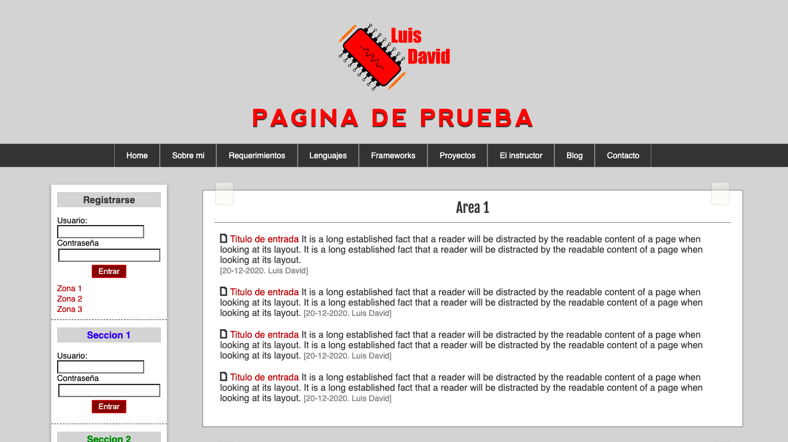

# News Template

## Table of contents

- [Overview](#overview)
  - [The challenge](#the-challenge)
  - [Screenshot](#screenshot)
- [My process](#my-process)
  - [Built with](#built-with)
  - [What I learned](#what-i-learned)
  - [Continued development](#continued-development)
- [Author](#author)

## Overview

### The challenge

Users should be able to:

- View the page only on computer screen
- See visual examples of login
- See a template of a news page
- Does not include shipping or backend features

### Screenshot

## My process

### Built with

- HTML
- CSS

### What I learned

On this page I learned to develop registration forms, on the front end side, also to make a page divided into sections to apply the same CSS styles to various elements and finally design a navigation menu, which in this case is not redirect me to no page.

### Continued development

The first thing that should be integrated in the future is the use of media queries to be able to view the content on any type of device, in addition to making the login forms functional or even integrating an api to display the information received.

## Author

Luis David Jimenez Martinez
- Portfolio - [www.luisdavidjm.com](https://www.luisdavidjm.com)
- GitHub - [LuisDavidJM](https://github.com/LuisDavidJM)
